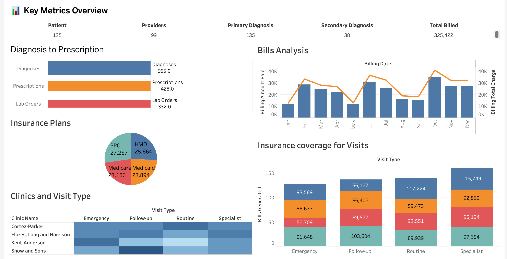

<!-- Database Normalization

Introduction:
This project normalizes a legacy flat structured healthcare system data into a scnowflake scehma. The aim is to transform the raw data into a structured database schema. The resulting structure is optimized and supports efficient querying and data management.
The data contains key information around doctor appointments. 
It has 47 columns. This dataset will be normalized into 11 tables following the starflake schema. -->

# Healthcare Data Normalization with PySpark

This project transforms a flat healthcare CSV dataset into a fully normalized schema using PySpark. It adheres to dimensional modeling practices and is designed to prepare the data for analytical or reporting use in systems like Snowflake or other data warehouses.

---

## 🔧 Built With
- Python 3.12+
- Apache Spark (PySpark)

---

## ✨ Key Features

- Parses a flat legacy CSV containing 47+ columns
- Breaks data into **11 normalized tables** (10 dimensions + 1 fact)
- Handles:
  - Primary & secondary diagnosis
  - Provider & location assignment
  - Treatment, lab orders, and prescriptions
  - Patient activity status derivation ("Active" or "Inactive")
- Assigns **surrogate keys** using `monotonically_increasing_id()`
- Saves all outputs as single `.csv` files with consistent column order

---

## ⚙️ Architecture Overview

The main logic lives in the `DataProcessor` class, which:

1. Loads and parses the raw CSV
2. Constructs each dimension with deduplication & surrogate keys
3. Builds the fact table by joining with dimensions
4. Writes out 11 CSVs to the `./data/answers/` folder

---

## 🔍 Table Breakdown

### Dimensions (Dim*)
| Table Name              | Key Column              | Notes |
|-------------------------|-------------------------|-------|
| DimPatient              | patient_id              | Uses existing ID + derived status
| DimInsurance            | insurance_id            | Uses existing ID
| DimBilling              | billing_id              | Uses existing ID
| DimProvider             | provider_id             | Generated from (doctor_name, doctor_title, doctor_department)
| DimLocation             | location_id             | Generated from (clinic_name, room_number)
| DimPrimaryDiagnosis     | primary_diagnosis_id    | Generated from (code, description)
| DimSecondaryDiagnosis   | secondary_diagnosis_id  | Generated from (code, description)
| DimTreatment            | treatment_id            | Generated from (code, description)
| DimPrescription         | prescription_id         | Uses existing ID
| DimLabOrder             | lab_order_id            | Uses existing ID

### Fact
| Table Name | Foreign Keys | Description |
|------------|--------------|-------------|
| FactVisit  | Links to all dimensions via FK columns | Contains one row per visit |

---

## 📂 Folder Structure
```
project-root/
├── data/
│   ├── legacy_healthcare_data.csv
│   └── answers/  → Output CSVs
├── image/
│   ├── Vizualization.png
├── src/
│   ├── main.py
│   └── data_processor.py
```

---

## 🚀 How to Run

```bash
# Step into project directory and activate env
python3 src/main.py
```

---
## 📊 Tableau Dashboard

Here's a glimpse of the Tableau Dashboard created from the normalized healthcare dataset:



---
## ✅ Project Checklist

- [x] Loaded legacy flat CSV data
- [x] Normalized into 11 tables using PySpark
- [x] Verified joins between Fact and Dimension tables by comparing original and joined values
- [x] Built a Tableau Dashboard
---

## 🔍 Notes
- Null values are filtered in dimension tables with surrogate keys
- Column order is preserved for consistency
- Validation steps (joins) are included for debug and verification


